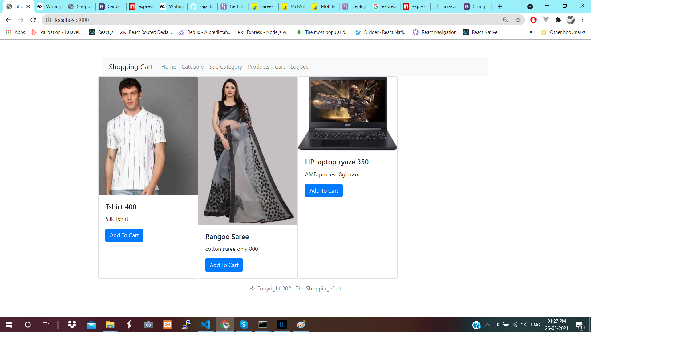
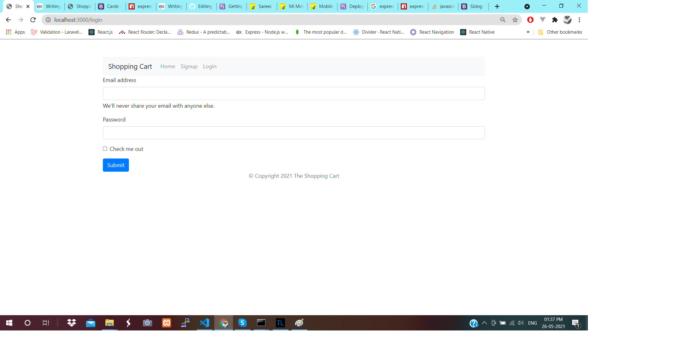
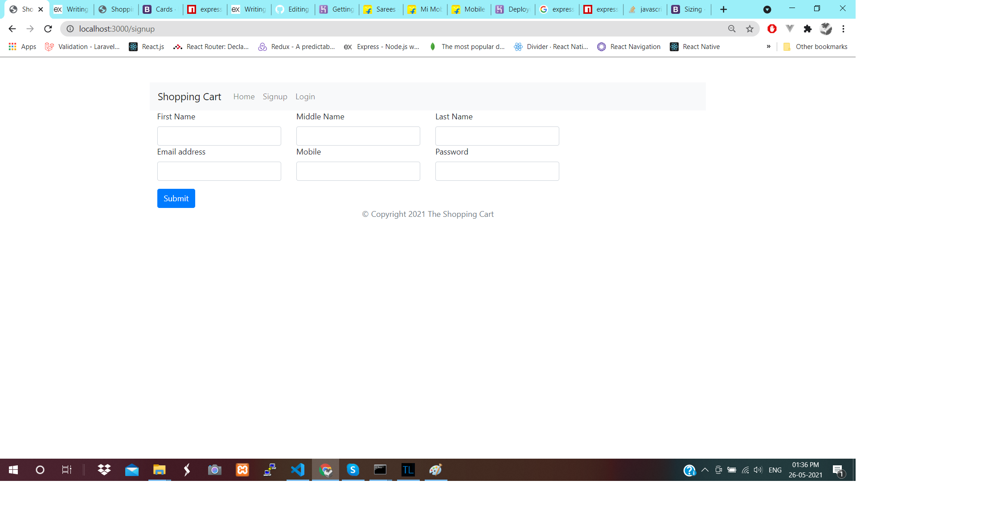
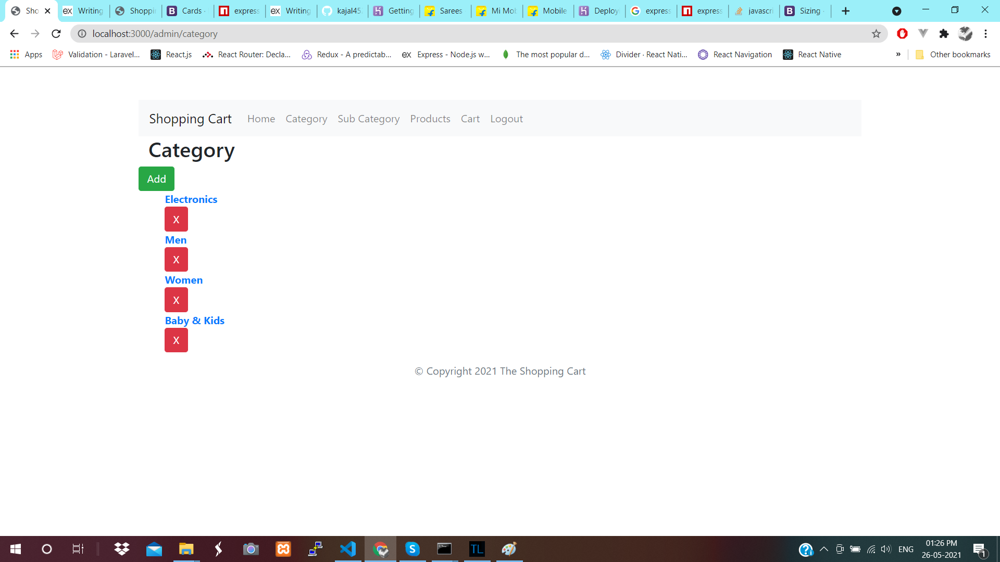
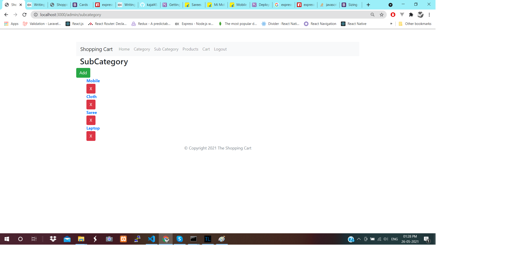
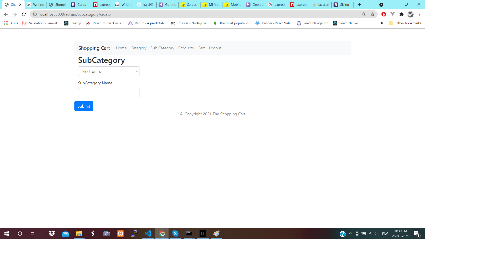
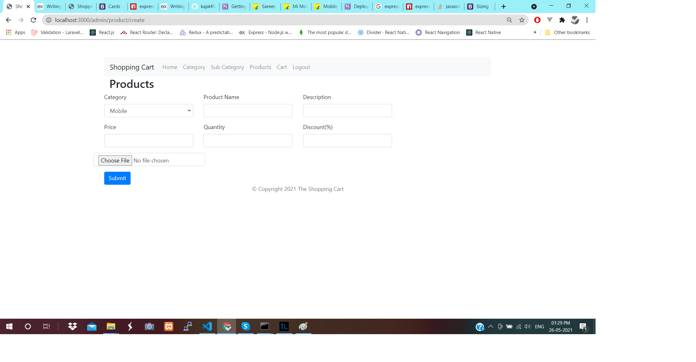

# Shopping Cart Project

This is simple Shopping Cart Project .

- node.js 12.16
- express.js
- mongoose
- ejs (view)
- express-session (for session login)
- multer (for image req)
- method-override (for multiple HTTP request support PUT,DELETE)
- bcrypt (password hash )
- dotenv (enviroment setupgit)

Screenshots
-------------
## Home Page

## Login 

## Signup 

## Category

## Subcategory

## Subcategory Add

## Product Add
